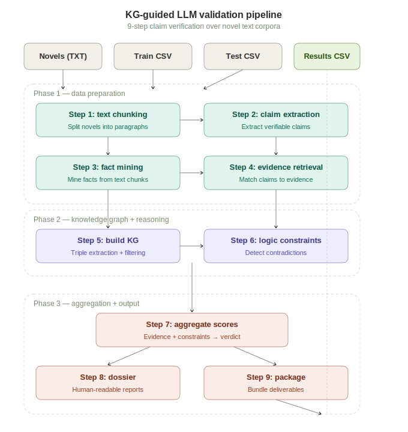

# KG-Guided LLM Validation & Reasoning System

A multi-stage pipeline that validates factual claims against novel text corpora using knowledge graph construction, evidence retrieval, and logic-based reasoning.

> Given a set of claims and source novels, the system builds a knowledge graph, retrieves supporting/contradicting evidence, applies logical constraints, and produces validated verdicts with human-readable dossiers.



---

## How It Works

The system runs a **9-step pipeline** organized into three phases:

### Phase 1 — Data Preparation

| Step | Name | What It Does |
|------|------|-------------|
| 1 | **Text Chunking** | Splits source novels into paragraph-level chunks with metadata |
| 2 | **Claim Extraction** | Extracts verifiable claims from training/test data |
| 3 | **Fact Mining** | Mines factual statements from text chunks with confidence scores |
| 4 | **Evidence Retrieval** | Matches claims against text chunks to find supporting/contradicting evidence |

### Phase 2 — Knowledge Graph + Reasoning

| Step | Name | What It Does |
|------|------|-------------|
| 5 | **Build Knowledge Graph** | Constructs KG triples from extracted facts (filtered by `min_fact_conf=0.65`) |
| 6 | **Logic Constraints** | Applies logical rules over the KG to detect contradictions and entailments |

### Phase 3 — Aggregation + Output

| Step | Name | What It Does |
|------|------|-------------|
| 7 | **Aggregate Scores** | Combines evidence labels + constraint signals into final verdicts (with `contradiction_penalty=2.0`) |
| 8 | **Dossier Generation** | Produces human-readable evidence reports per claim (top 4 claims, 3 evidence rows each) |
| 9 | **Package** | Bundles all outputs into a deliverable artifact with run manifest |

---

## Results

<!-- TODO: Fill in from accuracy.ipynb -->
| Metric | Score |
|--------|-------|
| Accuracy | *TBD — update from accuracy.ipynb* |
| F1 Score | *TBD* |

---

## Tech Stack

| Component | Technology |
|-----------|-----------|
| Language | Python 96.3% |
| LLM | *TBD — update with your LLM choice* |
| KG Construction | Custom triple extraction from text with confidence filtering |
| Data Processing | pandas, JSONL pipelines |
| Evaluation | Jupyter Notebook |
| Containerization | Docker |

---

## Getting Started

### Prerequisites

- Docker

### Build

```bash
docker build --progress=plain -t kdsh:dev -f src/docker/Dockerfile .
```

### Run Full Pipeline (~60 min)

```bash
docker run --rm -it \
  -v "${PWD}:/workspace" \
  -v "${PWD}/src:/app/src" \
  -w /workspace \
  kdsh:dev \
  --train "/workspace/data/train.csv" \
  --test "/workspace/data/test.csv" \
  --novels "/workspace/novels/In search of the castaways.txt" \
           "/workspace/novels/The Count of Monte Cristo.txt" \
  --outdir "/workspace/output" \
  --run-all
```

### Run Steps 5–9 Only (~2 min)

If you've already completed the data preparation phase and have intermediate outputs in the `silver/` directory, you can run just the KG + reasoning steps:

```bash
docker run --rm -it \
  --entrypoint python \
  -v "${PWD}:/workspace" \
  -w /workspace \
  -e PYTHONPATH=/workspace/src \
  -e RUN_ID=run_001 \
  kdsh:dev \
  -c "
from kdsh.pipeline.steps.step5_kg import step5_build_kg
from kdsh.pipeline.steps.step6_logic import step6_logic
from kdsh.pipeline.steps.step7_aggregate import step7_aggregate
from kdsh.pipeline.steps.step8_dossier import step8_dossier
from kdsh.pipeline.steps.step9_package import step9_package
# See src/ for full usage
"
```

### Data

The pipeline expects:
- **`train.csv`** — labeled training claims
- **`test.csv`** — unlabeled test claims  
- **`novels/`** — source text files (e.g., *In Search of the Castaways*, *The Count of Monte Cristo*)

---

## Project Structure

```
├── src/
│   ├── kdsh/
│   │   └── pipeline/
│   │       └── steps/
│   │           ├── step5_kg.py         # Knowledge graph construction
│   │           ├── step6_logic.py      # Logical constraint application
│   │           ├── step7_aggregate.py  # Evidence + constraint scoring
│   │           ├── step8_dossier.py    # Human-readable report generation
│   │           └── step9_package.py    # Output bundling
│   └── docker/
│       └── Dockerfile
├── configs/                            # Pipeline configuration files
├── novels/                             # Source text corpora
├── accuracy.ipynb                      # Evaluation notebook
├── requirements.txt
└── README.md
```

---

##  Key Design Decisions

- **Confidence-filtered KG**: Only facts above `min_fact_conf=0.65` become KG triples, reducing noise propagation
- **Contradiction penalty**: Claims with contradicting evidence are penalized 2× during aggregation, prioritizing precision
- **Dossier format**: Each claim gets a structured evidence report with top-4 key claims and 3 evidence rows per claim for human review
- **Dockerized pipeline**: Fully reproducible — no dependency issues across environments

---

## License

MIT

---

## Author

**Brijesh Dangwal**  
[GitHub](https://github.com/BrijeshDangwal) · [LinkedIn](https://linkedin.com/in/YOUR_LINKEDIN)
